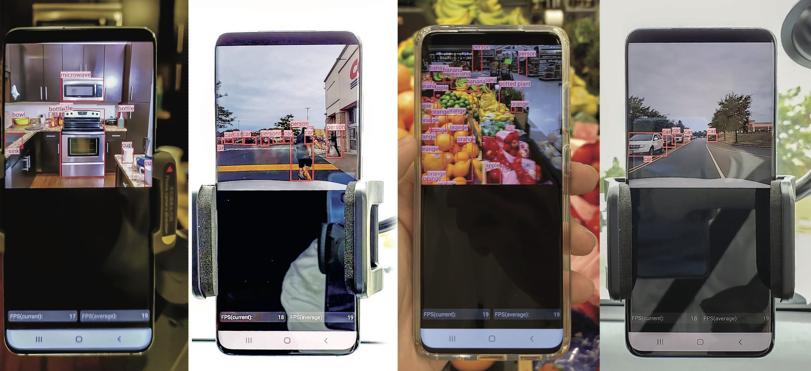
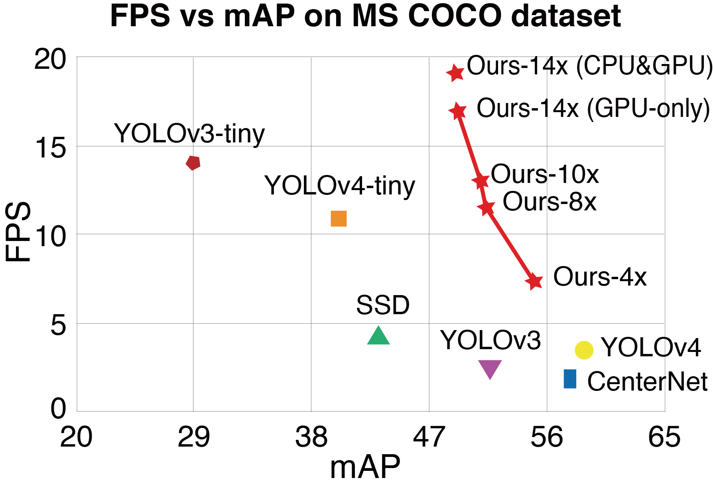

# YOLObile 
This is the implementation of [YOLObile: Real-Time Object Detection on Mobile Devices via Compression-Compilation Co-Design](https://arxiv.org/abs/2009.05697) using [ultralytics/yolov3](https://github.com/ultralytics/yolov3). Thanks to the original author.

arXiv: [https://arxiv.org/abs/2009.05697](https://arxiv.org/abs/2009.05697)
In Proceeding in AAAI 2021

**For those who may be interested in the compiler code (How to deploy it onto Android?):** The compiler source code is associated with our collaborator at William & Mary, and has joint IP related stuff. **We have no plans to open source this part now.** Sorry for the inconvenience.

**For IOS developer:** We only use Android platform to build and test the compiler because of the advantages of highly open source. We also believe the same techniques can be applied on Apple IOS platform, but we haven't tested it yet.




## Introduction
The rapid development and wide utilization of object detection techniques have aroused attention on both accuracy and speed of object detectors. However, the current state-of-the-art object detection works are either accuracy-oriented using a large model but leading to high latency
or speed-oriented using a lightweight model but sacrificing accuracy. In this work, we propose YOLObile framework, a real-time object detection on mobile devices via compression-compilation co-design. A novel block-punched pruning scheme is proposed for any kernel size. To improve computational efficiency on mobile devices, a GPU-CPU collaborative  scheme is adopted along with advanced compiler-assisted optimizations. Experimental results indicate that our pruning scheme achieves 14x compression rate of YOLOv4 with 49.0 mAP. 
Under our YOLObile framework, we achieve 17 FPS inference speed using GPU on Samsung Galaxy S20. 
By incorporating our proposed GPU-CPU collaborative scheme, the inference speed is increased to 19.1 FPS, and outperforms the original YOLOv4 by 5x speedup.

## Environments
Python 3.7 or later with all `pip install -U -r requirements.txt` packages including `torch == 1.4`. Docker images come with all dependencies preinstalled. Docker requirements are: 
- Nvidia Driver >= 440.44
- Docker Engine - CE >= 19.03

### Download Coco Dataset: (18 GB)
```shell script
cd ../ && sh YOLObile/data/get_coco2014.sh
```
The default path for coco data folder is outside the project root folder.

``` shell script
/Project
/Project/YOLObile (Project root)
/Project/coco (coco data)
```

### Download Model Checkpoints:
Google Drive: [Google Drive Download](https://drive.google.com/drive/folders/1FcWdXcWc3vScV-guIrxWsWGhjQwPOEQW?usp=sharing)

Baidu Netdisk: [Baidu Netdisk Download](https://pan.baidu.com/s/1FMTOQF6ebH6OJWEAq9F0KQ) code: r3nk

After downloads, please put the weight file under ./weights folder


## Docker build instructions

### 1. Install Docker and Nvidia-Docker

Docker images come with all dependencies preinstalled, however Docker itself requires installation, and relies of nvidia driver installations in order to interact properly with local GPU resources. The requirements are: 
- Nvidia Driver >= 440.44 https://www.nvidia.com/Download/index.aspx
- Nvidia-Docker https://github.com/NVIDIA/nvidia-docker
- Docker Engine - CE >= 19.03 https://docs.docker.com/install/

### 2. Build the project
```bash
# Build and Push
t=YOLObile && sudo docker build -t $t .
```

### 3. Run Container
```bash
# Pull and Run with local directory access
t=YOLObile && sudo docker run -it --gpus all --ipc=host -v "$(pwd)"your/cocodata/path:/usr/src/coco $t bash
```

### 4. Run Commands
Once the container is launched and you are inside it, you will have a terminal window in which you can run all regular bash commands, such as:
- `ls .`
- `ls ../coco`
- `python train.py`
- `python test.py`
- `python detect.py`

## Configurations:

**Train Options and Model Config:** 
```
./cfg/csdarknet53s-panet-spp.cfg (model configuration)
./cfg/darknet_admm.yaml (pruning configuration)
./cfg/darknet_retrain.yaml (retrain configuration)
```

**Weights:** 
```
./weights/yolov4dense.pt (dense model)
./weights/best8x-514.pt (pruned model)
```

**Prune Config**
```
./prune_config/config_csdarknet53pan_v*.yaml
```

## Training

The training process includes two steps:

**Pruning:** `python train.py --img-size 320 --batch-size 64 --device 0,1,2,3 --epoch 25 --admm-file darknet_admm --cfg cfg/csdarknet53s-panet-spp.cfg --weights weights/yolov4dense.pt --data data/coco2014.data` 

The pruning process does **NOT** support resume.

**Masked Retrain:** `python train.py --img-size 320 --batch-size 64 --device 0,1,2,3 --epoch 280 --admm-file darknet_retrain --cfg cfg/csdarknet53s-panet-spp.cfg --weights weights/yolov4dense.pt --data data/coco2014.data --multi-scale`.

The masked retrain process support resume.

You can run the total process via `sh ./runprune.sh`


## Check model Weight Parameters & Flops:
```shell script
python check_compression.py
```
## Test model MAP:

```shell script
python test.py --img-size 320 --batch-size 64 --device 0 --cfg cfg/csdarknet53s-panet-spp.cfg --weights weights/best8x-514.pt --data data/coco2014.data

```
```
               Class    Images   Targets         P         R   mAP@0.5        F1: 100%|| 79/79 [00:
                 all     5e+03  3.51e+04     0.501     0.544     0.508     0.512
              person     5e+03  1.05e+04     0.643     0.697     0.698     0.669
             bicycle     5e+03       313     0.464     0.409     0.388     0.435
                 car     5e+03  1.64e+03     0.492     0.547     0.503     0.518
          motorcycle     5e+03       388     0.602     0.635     0.623     0.618
            airplane     5e+03       131     0.676     0.786     0.804     0.727
                 bus     5e+03       259      0.67     0.788     0.792     0.724
               train     5e+03       212     0.731     0.797     0.805     0.763
               truck     5e+03       352     0.414     0.526     0.475     0.463
          toothbrush     5e+03        77      0.35     0.301     0.269     0.323
Speed: 3.6/1.4/5.0 ms inference/NMS/total per 320x320 image at batch-size 64

COCO mAP with pycocotools...
loading annotations into memory...
Done (t=3.87s)
creating index...
index created!
Loading and preparing results...
DONE (t=3.74s)
creating index...
index created!
Running per image evaluation...
Evaluate annotation type *bbox*
DONE (t=83.06s).
Accumulating evaluation results...
DONE (t=9.39s).
 Average Precision  (AP) @[ IoU=0.50:0.95 | area=   all | maxDets=100 ] = 0.334
 Average Precision  (AP) @[ IoU=0.50      | area=   all | maxDets=100 ] = 0.514
 Average Precision  (AP) @[ IoU=0.75      | area=   all | maxDets=100 ] = 0.350
 Average Precision  (AP) @[ IoU=0.50:0.95 | area= small | maxDets=100 ] = 0.117
 Average Precision  (AP) @[ IoU=0.50:0.95 | area=medium | maxDets=100 ] = 0.374
 Average Precision  (AP) @[ IoU=0.50:0.95 | area= large | maxDets=100 ] = 0.519
 Average Recall     (AR) @[ IoU=0.50:0.95 | area=   all | maxDets=  1 ] = 0.295
 Average Recall     (AR) @[ IoU=0.50:0.95 | area=   all | maxDets= 10 ] = 0.466
 Average Recall     (AR) @[ IoU=0.50:0.95 | area=   all | maxDets=100 ] = 0.504
 Average Recall     (AR) @[ IoU=0.50:0.95 | area= small | maxDets=100 ] = 0.240
 Average Recall     (AR) @[ IoU=0.50:0.95 | area=medium | maxDets=100 ] = 0.583
 Average Recall     (AR) @[ IoU=0.50:0.95 | area= large | maxDets=100 ] = 0.727
```

## FPS vs mAP on COCO dataset



## Already Known Issues
- The accuracy printed in retraining process is not accurate. Please run the test.py individually to check the accuracy. I raised this issue in the old versions of Ultralytics/YOLOv3 repository, and I am not sure if they had already solved yet. 


- When you use multi-card training（4 cards or more ), the training process may stop after a few hours without any errors printed.
I suggest using docker instead if you use 4 cards or more. The docker build instructions can be found above.

- Pytorch 1.5+ might have multi card issues

## Acknowledgements
[https://github.com/ultralytics/yolov3](https://github.com/ultralytics/yolov3)

[https://github.com/AlexeyAB/darknet](https://github.com/AlexeyAB/darknet)

## Contact Me
Github: [https://github.com/nightsnack](https://github.com/nightsnack) 

Email : nightsnackc@gmail.com
